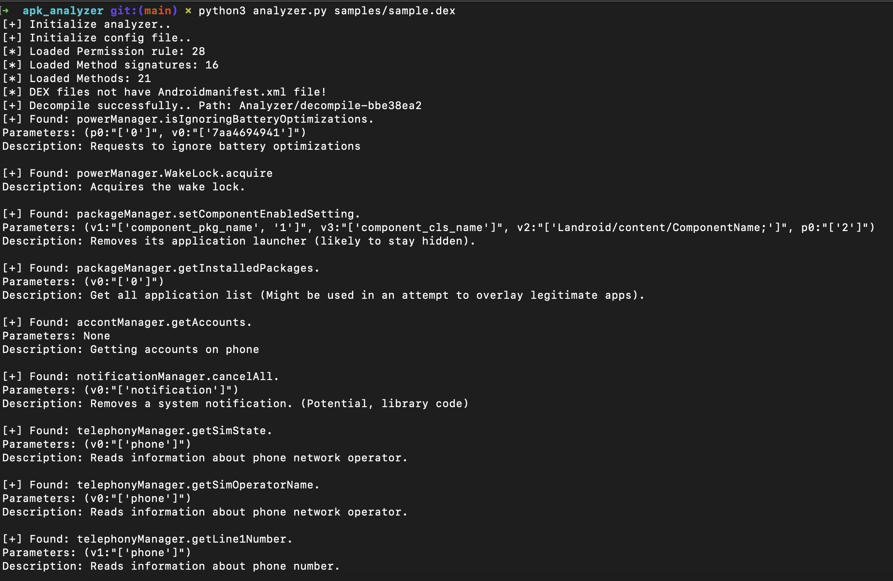

# APK/DEX Analysis Tool

This tool is designed to analyze Android APK and DEX files using a detailed configuration file (config.json). It inspects specific classes, methods, and parameters defined in the configuration, assessing permissions with descriptions, and checks if certain methods and parameters are utilized within the APK. 

# Setup

To use this tool, you need Python 3.x installed on your system. Install the necessary dependencies by running the following command in your terminal or command prompt:

```bash
pip3 install -r requirements.txt
```

# Configuration File

The config.json file defines the classes, methods, and parameters to be analyzed. Each key (e.g., powerManager, packageManager, accountManager) represents an Android class to be analyzed. Under these classes, the methods to be examined and their descriptions should be specified.

For instance, for the powerManager class, methods like isIgnoringBatteryOptimizations and WakeLock are defined. Each method is detailed with its name, used parameters, and a brief description.

# Usage

The tool is executed via the command line, taking the path to the APK or DEX file and the path to the configuration file as arguments.

```bash
python3 analyzer.py <apk/dex file> --configFile <config path> --outputPath <output dir> --debugMode <true/false>
```



# Features

**Permissions Analysis**: The tool examines the APK/DEX files for specific permissions mentioned in the configuration file, along with their descriptions, and reports occurrences.

**Method and Parameter Inspection**: Each method and its parameters defined in the configuration file are meticulously checked against the APK to see if they are used, including the utilization of specific parameter values.

**Concurrent Method Usage**: Identifies if defined methods are used simultaneously within the analyzed APK/DEX files, providing insights into the complex interactions within the application.

# Config usage

```json
"packageManager": {
    "className": "Landroid/content/pm/PackageManager",
    "functions": [
        {
            "setComponentEnabledSetting": {"methodNames": [[""]], "assignments": [{"v3":"component_cls_name"}], 
            "Description":"Removes its application launcher (likely to stay hidden)."},
            "getInstalledPackages": {"methodNames": [[""]], "assignments": [{}], 
            "Description":"Get all application list (Might be used in an attempt to overlay legitimate apps)."}
        }
    ]
},
"powerManager": {
    "className": "Landroid/os/PowerManager",
    "functions": [
        {"isIgnoringBatteryOptimizations": {"methodNames": [[""]], "assignments": [{}],
        "Description":"Requests to ignore battery optimizations"}},
        {"WakeLock": {"methodNames": [["isHeld", "acquire"]], "assignments": [{}], 
        "Description": "Acquires the wake lock."}}
    ]
},
```

**className**: it is class that contains functions and methods.

**functions**: functions to use

**methodNames**: refers to the name of a method within a class that performs a specific function.

**assignments**: typically refers to the values or objects assigned to variables or parameters within a method or scope.

# Analyzed Classes

The tool is capable of analyzing the following Android classes for a comprehensive understanding of application behavior, security aspects, and system interactions:

- `System`: Provides access to system-level operations and properties.
    - `loadLibrary`
- `PowerManager`: Manages power use and battery optimization.
    - `isIgnoringBatteryOptimizations`
    - `WakeLock`
- `PackageManager`: Handles information about application packages installed on the device.
    - `setComponentEnabledSetting`
    - `getInstalledPackages`
- `PackageInstaller`: Allows applications to install packages.
    - `createSession`
    - `openSession`
- `AccountManager`: Manages user accounts on the device.
    - `getAccounts`
- `NotificationManager`: Controls the posting and management of notifications.
    - `cancelAll`
- `TelephonyManager`: Provides information about the telephony services on the device.
    - `getSimState`
    - `getSimOperatorName`
    - `getLine1Number`
    - `getNetworkOperatorName`
    - `getImei`
- `SmsManager`: Manages SMS operations such as sending texts.
    - `getDefault`
    - `sendTextMessage`
- `SmsMessage`: Represents an SMS message for processing or creation.
    - `getMessageBody`
- `ApacheHttp`: Interfaces with the Apache HTTP client for network operations. (Deprecated in favor of `netHttp`)
    - `HttpPost`
    - `HttpResponse`
- `NetHttp`: Provides classes and interfaces for networking capabilities.
    - `connect`
    - `getResponseCode`
- `Crypto`: Includes classes for encryption, decryption, and secure storage.
    - `SecretKeySpec`
- `MediaProjection`: Manages the capture of content outside an application's window.
    - `createVirtualDisplay`
- `DevicePolicyManager`: Administers security and policy for device and application management.
    - `isAdminActive`
    - `lockNow`
- `AccessibilityService`: Assists users with disabilities in interacting with Android devices.
    - `onServiceConnected`
    - `onAccessibilityEvent`
- `WebView`: Displays web pages and executes JavaScript within an application.
    - `loadDataWithBaseURL`
    - `loadUrl`
    - `addJavascriptInterface`

This broad coverage allows for detailed analysis of how applications interact with the Android system and manage data, permissions, and resources.

# Output

Upon execution, the tool analyzes the APK/DEX file based on the specified classes, methods, and parameters in the configuration file. The findings, including used permissions, methods, parameters, and their values, are displayed in a user-friendly format either on the console or written to an output file.
